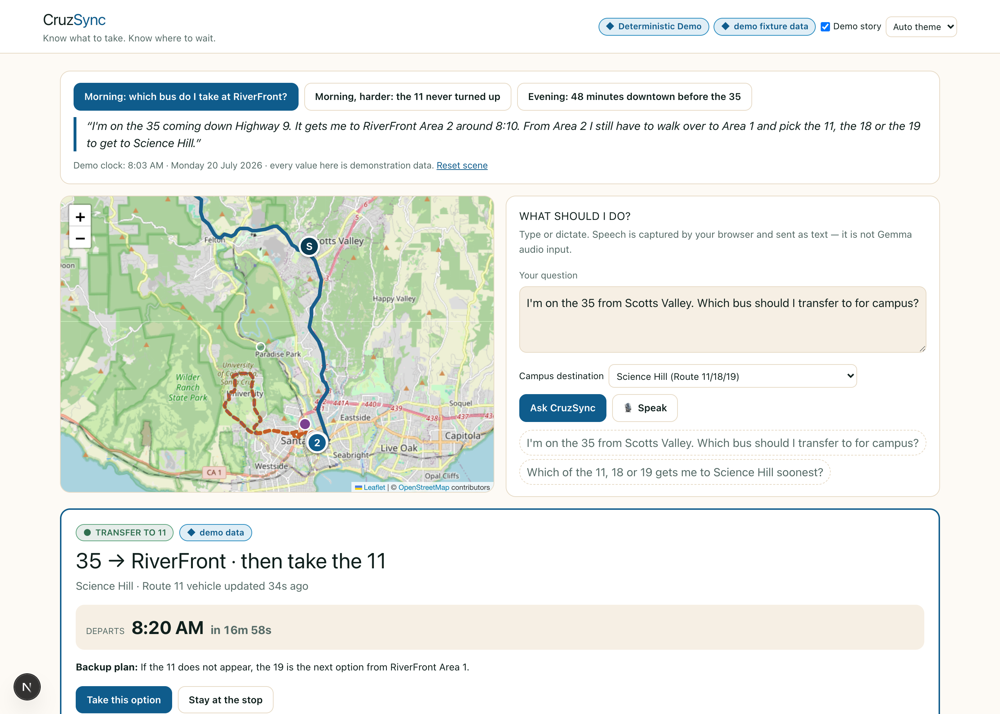
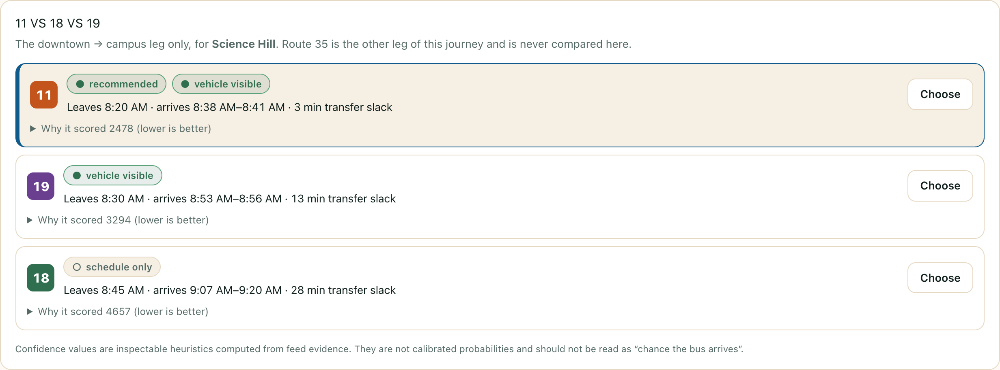
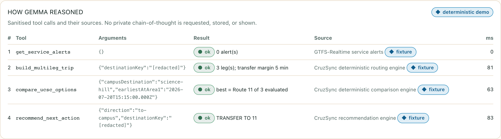
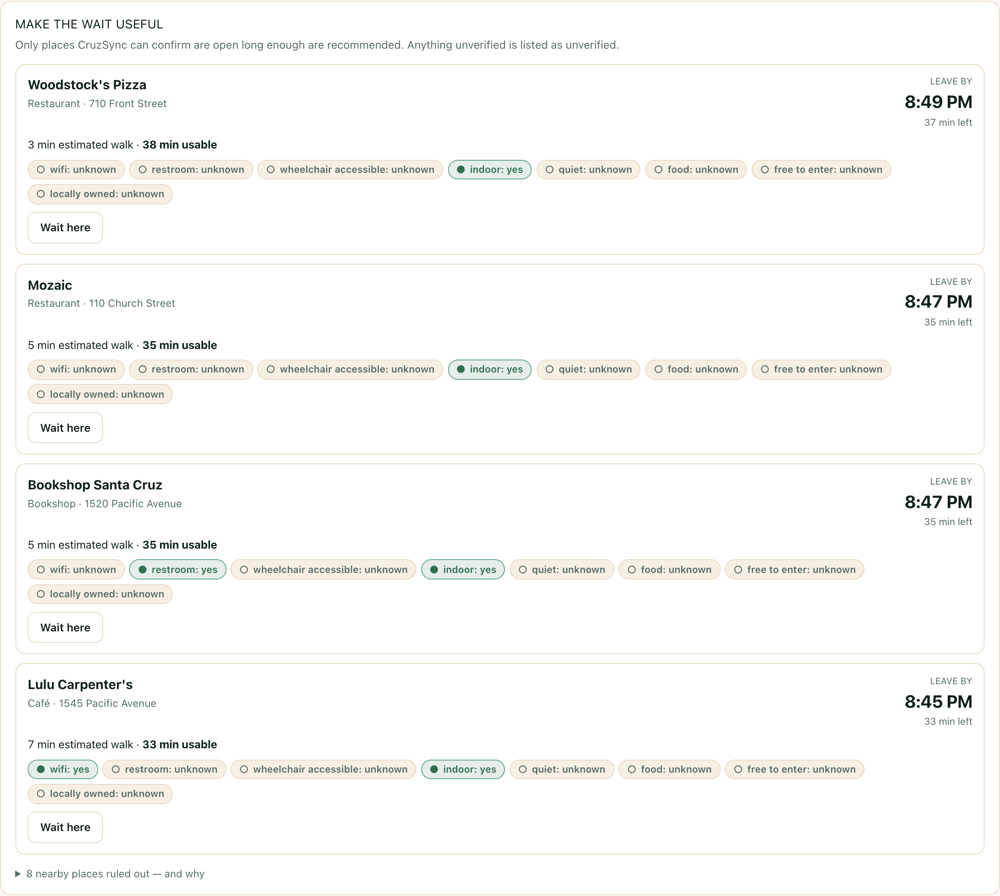
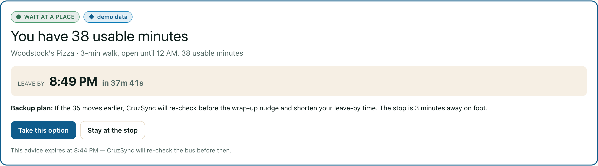

# CruzSync

**Know what to take. Know where to wait.**
_Turn dead bus time into useful neighbourhood time._

A Gemma-powered multi-leg commute and smart-waiting copilot for the Scotts Valley → UCSC
commute on Santa Cruz METRO.

Built for the **Cruz Into the Gemmaverse** hackathon — **Autonomous Agent** track.

> CruzSync is an independent student project. It is **not affiliated with, endorsed by, or
> operated by Santa Cruz METRO**, and it is rider decision support only — never an official
> source of service information.



---

## The problem, in my own words

> I'm a student commuting from Scotts Valley to UCSC. First I have to catch the 35 into
> downtown Santa Cruz. Then I transfer at RiverFront to the 11, 18 or 19 for campus. The 11 is
> sometimes faster and, in my experience, usually less crowded — but sometimes it does not show
> up when expected. If I miss the 35, or have a long wait downtown, I also want to know whether
> I have enough time to grab coffee, study, browse a bookstore, or sit somewhere comfortable
> without missing the next bus. A normal transit app gives me a list of times. CruzSync
> understands the whole trip and tells me what I can safely do with the wait.

Two things make this commute hard, and both are visible in the real timetable:

1. **Route 35 is scarce.** Outbound from downtown it runs every 30 minutes in the early
   evening and then drops to **hourly after 20:00**. Missing it is expensive.
2. **The campus leg is a genuine three-way choice.** Routes 11, 18 and 19 leave downtown
   staggered roughly ten minutes apart, take different paths, and do not all serve the same
   places on campus.

A trip planner that treats those as one undifferentiated list of departures is answering the
wrong question.

---

## What CruzSync actually models

This commute has **two sequential legs**, never two competing options.

|           |                                                                                                                                                                     |
| --------- | ------------------------------------------------------------------------------------------------------------------------------------------------------------------- |
| **Leg 1** | Route 35: Scotts Valley ↔ **RiverFront Area 2** (`Soquel Ave & Front`, stop `1466`)                                                                                 |
| **Walk**  | Area 2 → Area 1 outbound; Area 3 → Area 2 on the way home (~3 min)                                                                                                  |
| **Leg 2** | Routes 11 / 18 / 19: **RiverFront Area 1** (`River St S. & Soquel Ave`, stop `1726`) → UCSC, returning to **RiverFront Area 3** (`Front & Soquel Ave`, stop `1594`) |

Those three "areas" are three genuinely distinct GTFS stops about 100 m apart — not three
names for one stop. Routes 11/18/19 run as downtown → campus → downtown loops, which is
exactly why they depart from Area 1 but arrive back at Area 3.

**Route 35 is never compared against 11, 18 or 19.** They are different legs of one journey.
The comparison tool physically cannot accept Route 35 as a candidate — its schema rejects it.

### Two facts that fall out of the real data

Both were computed from `stop_times.txt`, not assumed:

- **Routes 11 and 19 run the campus loop one way; Route 18 runs it the other.** The same
  physical destination is a _different_ GTFS stop depending on which bus you board, and it
  sits at a different point in the loop. Ride time to a given destination therefore differs
  by route in a way no constant offset captures.
- **Coverage differs.** Only Route 18 reaches Crown & Merrill, the East Field House and Family
  Student Housing. Only Routes 11 and 19 reach Kerr Hall. Choosing a destination can eliminate
  options outright — so CruzSync asks where on campus you're going, because it changes the
  answer.

### About the Route 11 "gamble"

Route 11 reaching Science Hill roughly 15 minutes faster than Route 19 is a fact from the
timetable. Route 11 _feeling_ less crowded is **my personal experience, saved as a preference**
— it is worth 90 seconds in the ranking, disclosed as a rider note, and it cannot override a
route that genuinely gets you there sooner or more safely. There is a test asserting exactly
that.

Where the agency publishes `occupancyStatus` in its real-time feed, CruzSync uses it and labels
it as agency-reported. It never invents a passenger count.

---

## Screens

| Comparing the campus leg                                | The sanitised tool trace                          |
| ------------------------------------------------------- | ------------------------------------------------- |
|  |  |

| Making the wait useful                              | The leave-by countdown                        |
| --------------------------------------------------- | --------------------------------------------- |
|  |  |

---

## Architecture

Five layers with hard boundaries. Full detail and a Mermaid diagram in
[`docs/architecture.md`](docs/architecture.md).

```
Transit ingestion  →  Deterministic engine  →  Gemma agent  →  Rider decision UI
                             ↕
                     Waiting-place engine
```

The rule that holds the whole design together:

> **Code computes. The model explains.**

Gemma chooses which tools to call and writes the prose. It never adds times, never computes a
headway, never works out when you must leave. Every number on screen comes from a pure,
versioned, unit-tested engine (`ENGINE_VERSION`, surfaced in the UI). If Gemma is unavailable
the recommendation is identical — only the wording degrades, and the UI says so.

### Layers

1. **Transit ingestion** (`src/lib/gtfs`, `src/lib/rt`) — static GTFS pruned to routes
   11/18/19/35 and committed (~1.1 MB, so the app boots and tests run with no network).
   GTFS-Realtime vehicles, trip updates and alerts are decoded **server-side** with the
   official MobilityData bindings, so the browser never touches protobuf or CORS. Freshness is
   tracked per snapshot: fresh ≤ 90 s, stale ≤ 300 s, expired beyond that.

2. **Deterministic engine** (`src/lib/engine`) — evidence scoring, computed headway, multi-leg
   construction, the three-way comparison, and the safe-wait maths. Pure functions, no I/O.

3. **Waiting-place engine** (`src/lib/places`) — OpenStreetMap/Overpass by default (keyless),
   Google Places when a key is configured. Feasibility gating and ranking.

4. **Gemma agent** (`src/lib/agent`) — 12 Zod-typed tools, native function calling, a sanitised
   trace.

5. **Rider decision UI** (`src/components`) — the map, the comparison, the evidence, the
   countdown, and the civic dashboard.

### How the scoring works

Confidence is an **inspectable heuristic in [0,1], not a calibrated probability**. We have no
historical arrival outcomes for Santa Cruz METRO, so nothing here is calibrated, and the UI
says so next to every score. It starts from a schedule-only baseline and moves as evidence
appears: a fresh vehicle position, the age of a trip update, schedule deviation, active alerts.

Options are ranked in **seconds**, so every term is directly comparable and readable off the
screen:

```
score = conservative_arrival
      + transfer_risk          (steep and non-linear as slack approaches zero)
      + evidence_risk          ((1 − confidence) × what a no-show would actually cost)
      + preference_penalties   (small; ties only)
```

`evidence_risk` deserves a note. A flat penalty for "we can't see this bus" is the wrong
shape: not seeing a bus matters enormously when the fallback is 25 minutes later and barely at
all when another follows four minutes behind. So the risk is priced against the **genuinely
next-best arrival from the timetable**. That is why, when the 11 goes quiet, CruzSync switches
to the 19 in the evening but may quite reasonably still recommend waiting for the 11 at a time
of day when the downside is four minutes.

### The safe-wait maths

```
usable_wait   = predicted_departure − now − walk_back − boarding_buffer − uncertainty_buffer
leave_by      = predicted_departure − walk_back − boarding_buffer − uncertainty_buffer
place_is_safe = open_through(leave_by) && usable_wait >= minimum_useful_visit
```

The uncertainty buffer **grows** when evidence is weak, when the feed is behind, when the
vehicle is moving fast (it may arrive _early_, which is precisely how a comfortable rider gets
caught out), and when walking time is estimated rather than verified. Uncertainty must always
cost the rider time, never earn it.

---

## Honesty rules

These are enforced in code and covered by tests, because each corresponding failure would
produce confident, plausible, wrong advice.

- **A missing vehicle is not a cancellation.** The only thing that lets CruzSync say a bus is
  cancelled is the agency publishing `scheduleRelationship: CANCELED`, or an alert saying so.
  Otherwise the wording is _"No current vehicle position is visible for this trip"_, together
  with what that does and does not mean.
- **Amenities are `true | false | 'unknown'`, never inferred from category.** A café is not
  automatically quiet. A bookshop does not automatically have a restroom. A restaurant does not
  automatically have step-free access. A wheelchair user acting on an invented accessibility
  claim is a real person having a bad evening, so unknown stays unknown and is displayed as
  "unknown".
- **Unverifiable hours block a recommendation.** If CruzSync cannot confirm somewhere is open
  through your leave-by time, it will not tell you to go there. It says the hours are
  unconfirmed and offers staying near the stop.
- **Sponsorship cannot buy feasibility or rank.** The `sponsored` flag is carried for
  disclosure only and contributes exactly zero to the score. There is a test asserting two
  otherwise-identical venues score identically.
- **Demo data is never dressed as live.** Every snapshot carries `origin: 'live' | 'cache' |
'fixture'`, rendered in the header, on the recommendation card, and on every row of the
  tool trace.
- **No chain-of-thought.** The trace records what the agent _did_ — tool, redacted arguments,
  duration, source, timestamp, result summary. No private reasoning is requested, stored or
  displayed.

---

## Running it

```bash
npm install
cp .env.example .env.local     # optional; works fully without any key
npm run dev                    # http://localhost:3000
```

With no configuration at all, CruzSync runs end to end in **Deterministic Demo** mode: real
timetable, real geometry, real place data, deterministic explanations, no language model.

To enable **Live Gemma**, put a Google AI Studio key in `.env.local`:

```bash
GEMMA_PROVIDER=google
GOOGLE_API_KEY=your-key-here
GEMMA_MODEL=gemma-4-31b-it
```

The badge in the header always states which mode is running and why.

### Commands

| Command                       | What it does                                                  |
| ----------------------------- | ------------------------------------------------------------- |
| `npm run dev`                 | Development server                                            |
| `npm run build` / `npm start` | Production build and serve                                    |
| `npm test`                    | 132 unit and integration tests                                |
| `npm run verify`              | format + lint + typecheck + test + writeup word count + build |
| `npm run gtfs:build`          | Re-download and re-prune the METRO GTFS feed                  |
| `npm run places:verify`       | Re-verify downtown venues against live OpenStreetMap          |

### Environment variables

See [`.env.example`](.env.example). Briefly: `GEMMA_PROVIDER`, `GOOGLE_API_KEY`, `GEMMA_MODEL`,
`DEMO_MODE`, and the optional `GOOGLE_PLACES_API_KEY`. All are read server-side only; none is
ever sent to the browser.

**A note on model ids.** The Gemini API serves exactly two Gemma 4 models:
`gemma-4-31b-it` and `gemma-4-26b-a4b-it`. Ids like `gemma-4-12b-it` exist on Hugging Face but
are **not** callable on `generativelanguage.googleapis.com`. CruzSync validates the configured
id up front and explains the problem rather than surfacing an opaque 404.

Deployment notes are in [`docs/DEPLOY.md`](docs/DEPLOY.md).

---

## Demo modes

**Reliable story demo** — three reproducible scenes anchored to Monday 2026-07-20, built on the
real timetable so the engine does genuine arithmetic. Only the real-time _vehicle evidence_ is
fabricated, because we cannot make METRO run a bus on cue during a recording. Every value is
labelled demo data, and there is a "Reset scene" control.

1. **Morning** — on the 35, choosing between the 11, 18 and 19 for Science Hill.
2. **Morning, harder** — 08:22, and the 08:20 Route 11 simply never appeared. The next 11 is at
   08:50; CruzSync moves to the 19 it can actually see.
3. **Evening** — back at Area 3 at 20:12 with the next 35 at 21:00. A genuine 48-minute gap,
   because the real evening headway degrades from 30 to 60 minutes.

Each scene starts at a fixed clock and then runs forward in real time, so the opening state is
reproducible while the countdowns are genuinely live.

**Live Santa Cruz view** — untick "Demo story" to use the real feeds. If no confident transfer
can be constructed, CruzSync says so rather than distorting the data to fit the script.

---

## Limitations

Stated plainly, because a system that hides its failure modes cannot be trusted with a bus.

- **Confidence scores are uncalibrated heuristics**, not probabilities. Calibrating them needs
  historical arrival outcomes that are not published.
- **Walking times are estimates** (great-circle distance × 1.35 detour factor) unless a routing
  provider is configured. They are labelled "estimated" everywhere, and estimation buys extra
  uncertainty buffer.
- **OpenStreetMap hours coverage downtown is partial** — roughly 40% of nearby venues publish
  usable `opening_hours`. Missing hours produce "unknown", never an optimistic guess. A Google
  Places key improves this substantially.
- **Abbott Square Market is not present in OpenStreetMap** within 700 m of the stop, so it does
  not appear in the keyless build. Bookshop Santa Cruz, Santa Cruz Coffee Roasting, Verve
  Coffee Roasting and Mariposa Coffee Bar were all verified and are present.
- **No crowding data beyond the agency feed.** Route 11 being "less crowded" is a saved rider
  preference.
- **The Live Gemma path requires the operator's own API key.** Without one the app is fully
  functional in labelled deterministic mode.
- **Single-instance snapshot cache.** The last-good real-time snapshot is held in process
  memory; a multi-instance deployment would want shared storage.
- **The place-visit recommendation assumes you can leave promptly.** It cannot know that you
  are mid-conversation or waiting for a coffee to be made.

---

## Privacy

Only anonymised, in-session data is kept. A "the bus didn't show" report records the route, the
stop, the expected time and the feed evidence — nothing else. No names, no student identity, no
voice recordings, no precise location history, no free text. Trace arguments are redacted
before display: credential-shaped keys are masked, rider free text is replaced with a length
marker, and coordinates are coarsened to roughly 100 m.

Speech input, where used, is captured by the browser's own Web Speech API and sent as **text**.
It is presented as input capture and is explicitly _not_ Gemma audio input.

---

## Attribution

- Transit data © **Santa Cruz METRO** — <https://developer.scmetro.org>. GTFS feed version
  `S1000116`. Not affiliated with or endorsed by METRO.
- Place data and map tiles © **OpenStreetMap** contributors, ODbL —
  <https://www.openstreetmap.org/copyright>.
- GTFS-Realtime bindings by **MobilityData** —
  <https://github.com/MobilityData/gtfs-realtime-bindings>.

### Engineering patterns credited

Studied for approach only. No branding, text, domain or implementation was copied from any of
them.

- **Medigent One** — one model in distinct roles, visible native function calling, explicit
  orchestration.
- **MeshGemma** — building the demo around a concrete operational constraint.
- **LIKAS** — constrained tool use and safe behaviour under uncertainty.
- **CivicInsight** — source grounding, verification, and honest documentation of failure modes.
- **Paath** — retrieval for volatile facts rather than memorising them.
- **SolarHive** — domain-specific tools and transparent architecture.

## Licence

MIT — see [`LICENSE`](LICENSE).
