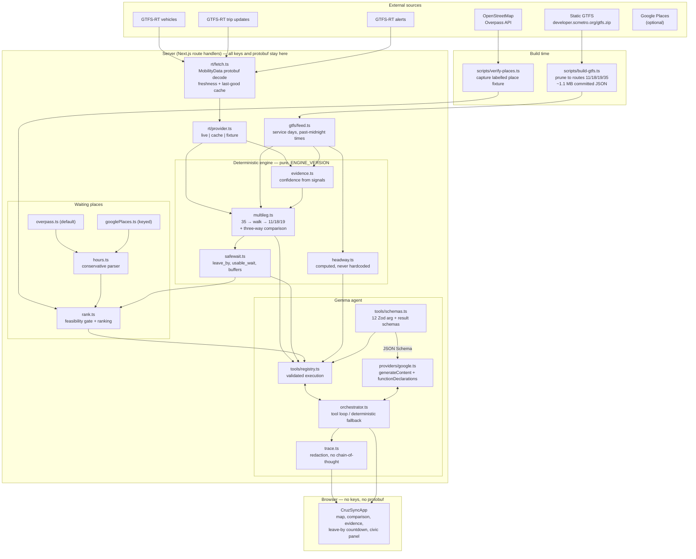
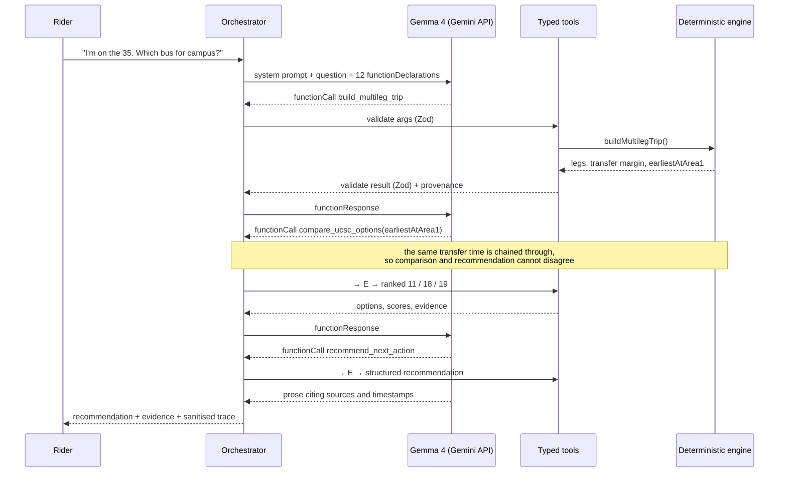

# CruzSync architecture

## The one rule

> **Code computes. The model explains.**

Gemma decides *which* questions to ask and turns the answers into something a tired student can
act on. It never performs the arithmetic. Every time, margin, headway and countdown on screen
comes from a pure, versioned, unit-tested engine.

This is not a stylistic preference. A language model that miscalculates a leave-by time by four
minutes produces advice that is fluent, confident and wrong, and the rider misses an hourly
bus. Putting the arithmetic behind typed tools means the worst a model failure can do is
degrade the prose — which is why the deterministic fallback produces an identical
recommendation.

## System diagram

## The agent loop

If any step fails — no key, provider error, rate limit, blocked prompt — the orchestrator runs
the same tools on a fixed plan and composes the answer from a template. The label changes from
`live-gemma` to `deterministic-fallback` and the reason is displayed. The recommendation does
not change.

## Responsibility boundaries

| Layer | Owns | Must never |
|---|---|---|
| **Ingestion** `gtfs/`, `rt/` | Fetching, protobuf decoding, normalising, freshness | Interpret data, or let protobuf/keys reach the browser |
| **Engine** `engine/` | All arithmetic: evidence, headway, margins, ranges, buffers | Perform I/O, or depend on a model |
| **Places** `places/` | Discovery, hours parsing, feasibility, ranking | Infer an amenity from a category, or treat unknown hours as open |
| **Agent** `agent/` | Tool selection, argument construction, prose, citation | Compute a number, assert an unsupported fact, expose reasoning |
| **UI** `components/` | Presentation, interaction, honest labelling | Recompute anything, or render a value without its provenance |

## Key data decisions

**Why the GTFS feed is pruned and committed.** The raw feed is ~15 MB unzipped
(`stop_times.txt` alone is 6.4 MB). Pruned to the four routes and stored as tuple-encoded JSON
it is ~1.1 MB, which is small enough to commit. The app therefore boots, and the entire test
suite runs, with no network access at all. `npm run gtfs:build` refreshes it and records the
feed version and fetch time.

**Why real-time decoding is server-side.** `rt.scmetro.org` serves
`application/x-google-protobuf` and does not send CORS headers. Decoding in a route handler
removes both problems and keeps the browser bundle free of protobuf machinery.

**Why the three RiverFront areas are separate constants.** They are three distinct GTFS stops
(`1726`, `1466`, `1594`) roughly 100 m apart. Collapsing them would erase the inter-area walk
that the entire transfer-margin calculation depends on.

**Why `earliestAtArea1` is chained between tools.** `compare_ucsc_options` called with "now"
and the same comparison called with the Route 35 arrival time can legitimately pick different
winners. Showing a judge a comparison card that says "Route 19" beside a recommendation that
says "take the 11" destroys trust instantly, so the transfer time computed by
`build_multileg_trip` is threaded into the comparison. The same reasoning is why
`recommend_next_action` returns the wait-place ranking it actually used rather than letting the
UI compute a second one with a different uncertainty buffer.

**Why `Tristate` instead of `boolean`.** Making unknown a distinct value at the type level
means a developer cannot accidentally write `if (place.hasWifi)` and silently treat "we don't
know" as "no" — or worse, default it to "yes".

## Versioning

`ENGINE_VERSION` in `src/lib/domain.ts` is bumped whenever the scoring maths changes. It is
attached to every tool result's provenance and rendered in the UI, so a recorded demo can
always be tied back to the exact formula that produced it.

## Testing strategy

132 tests across four files, all runnable offline:

| File | Covers |
|---|---|
| `tests/gtfs.test.ts` | Feed integrity, service days, past-midnight times, and the real network geometry — these assertions are pinned to independently verified facts so a future feed change fails loudly rather than silently misleading riders |
| `tests/engine.test.ts` | Evidence scoring, alerts, computed headway, the three-way comparison, transfer margins, arrival ranges, safe-wait maths, buffer growth |
| `tests/places.test.ts` | Hours parsing (including refusal to guess), unknown-unless-sourced amenities, closing-before-leave-by, filters, sponsorship neutrality |
| `tests/agent.test.ts` | Tool schema surface, argument and result validation, trace redaction, prompt guardrails, config honesty, and end-to-end happy paths |
